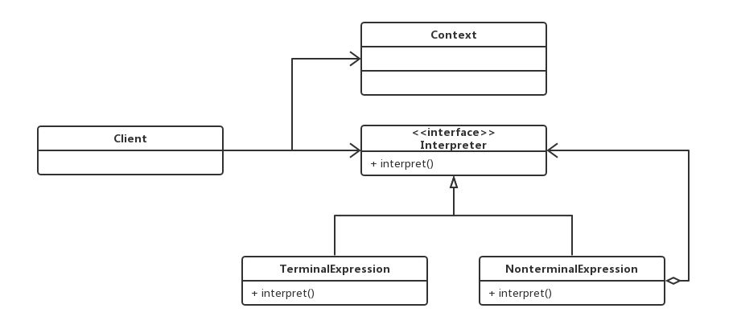
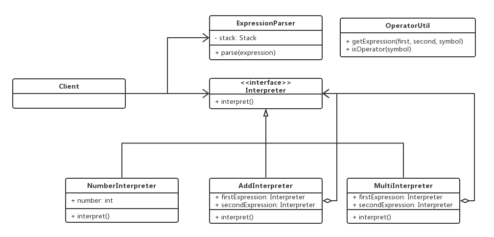

## 模板方法模式
### 1.1 类型：行为型

### 1.2　　定义：

◆定义：定义了一个算法的骨架，并允许子类为一个或多个步骤提供实现

◆模板方法使得子类可以在不改变算法结构的情况下，重新定义算法的某些步骤

如：a 把冰箱门打开，b 装大象  c 把冰箱门关上

### 1.3　　适用场景：
◆各子类中公共的行为被提取出来并集中到一个公共父类中，从而避免代码重复

◆一次性实现一个算法的不变的部分，并将可变的行为留给子类来实现

比如：我开冰箱门和关冰箱门的共同部分抽取出来，用一些子类继承这些模板，具体装大象还是装老虎，由这些子类来实现。

### 1.4　　优点：
◆提高复用性（将相同代码部分放到抽象父类中）

◆提高扩展性

◆符合开闭原则

### 1.5　　缺点：
◆继承关系自身缺点，如果父类添加新的抽象方法，所有子类都要改一遍

◆类数目增加

◆增加了系统实现的复杂度

### 1.6　　模板方法扩展：
钩子方法：详细参考代码

### 1.7　　与其他设计模式关系：
模板方法和工厂方法模式：

工厂方法是模板方法的一种特殊实现。

模板方法模式和策略模式：

模板方法模式不改变算法流程的，策略方法可以改变算法流程的，并且策略方法之间是可以相互替换的。

这两中方式都有封装方法。策略方法模式的目的是使不同的算法可以相互替换，并且不影响应用层客户端的使用。

模板方法模式是针对定义一个算法的流程，将一些不太一样的具体步骤交给子类去实现。

### 1.8 源码解析
1.1　　　　源码解析1(在jdk中的使用)
AbstractList（父类）
```java
public abstract class AbstractList<E> extends AbstractCollection<E> implements List<E> {

//get方法为抽象方法，完全交给子类去实现

abstract public E get(int index);

}
```
ArrayList（子类）
```java
public class ArrayList<E> extends AbstractList<E>
        implements List<E>, RandomAccess, Cloneable, java.io.Serializable
{
//子类来实现get方法
 public E get(int index) {
        rangeCheck(index);

        return elementData(index);
    }
}
```
同理：AbstractSet，AbstractMap同样采用了模版方法模式

#### 1.2　　　　源码解析2（在servlet中的应用）
HttpServlet
```java
public abstract class HttpServlet extends GenericServlet {
/***
   *    doget方法，dopost方法，service方法
   *     httpServlet中定义了一套模版，我们使用的时候只要继承httpServlet，并且实现doget和dopost方法就可以了
   *     注意：权限是protected，也就是只有子类才能实现这些方法
   */

//doget方法
    protected void doGet(HttpServletRequest req, HttpServletResponse resp) throws ServletException, IOException {
        String protocol = req.getProtocol();
        String msg = lStrings.getString("http.method_get_not_supported");
        if (protocol.endsWith("1.1")) {
            resp.sendError(405, msg);
        } else {
            resp.sendError(400, msg);
        }

    }

//dopost方法
    protected void doPost(HttpServletRequest req, HttpServletResponse resp) throws ServletException, IOException {
        String protocol = req.getProtocol();
        String msg = lStrings.getString("http.method_post_not_supported");
        if (protocol.endsWith("1.1")) {
            resp.sendError(405, msg);
        } else {
            resp.sendError(400, msg);
        }

    }
}
```
#### 1.3　　　　源码解析3（在mybaties中的应用）
BaseExecutor（父类）
```java
public abstract class BaseExecutor implements Executor {
//这是一个执行sql的类
//其中有四个方法，重点看doUpdate方法，
//它有四个子类，分别是在简单sql doupdate，复用sql doupdate，批量sql doupdate，等

   protected abstract int doUpdate(MappedStatement var1, Object var2) throws SQLException;

    protected abstract List<BatchResult> doFlushStatements(boolean var1) throws SQLException;

    protected abstract <E> List<E> doQuery(MappedStatement var1, Object var2, RowBounds var3, ResultHandler var4, BoundSql var5) throws SQLException;

    protected abstract <E> Cursor<E> doQueryCursor(MappedStatement var1, Object var2, RowBounds var3, BoundSql var4) throws SQLException;
}
```
子类BatchExecutor ：
```java
public class BatchExecutor extends BaseExecutor {
  @Override
  public int doUpdate(MappedStatement ms, Object parameterObject) throws SQLException {
    final Configuration configuration = ms.getConfiguration();
    final StatementHandler handler = configuration.newStatementHandler(this, ms, parameterObject, RowBounds.DEFAULT, null, null);
    final BoundSql boundSql = handler.getBoundSql();
    final String sql = boundSql.getSql();
    final Statement stmt;
    if (sql.equals(currentSql) && ms.equals(currentStatement)) {
      int last = statementList.size() - 1;
      stmt = statementList.get(last);
      applyTransactionTimeout(stmt);
     handler.parameterize(stmt);//fix Issues 322
      BatchResult batchResult = batchResultList.get(last);
      batchResult.addParameterObject(parameterObject);
    } else {
      Connection connection = getConnection(ms.getStatementLog());
      stmt = handler.prepare(connection, transaction.getTimeout());
      handler.parameterize(stmt);    //fix Issues 322
      currentSql = sql;
      currentStatement = ms;
      statementList.add(stmt);
      batchResultList.add(new BatchResult(ms, sql, parameterObject));
    }
  // handler.parameterize(stmt);
    handler.batch(stmt);
    return BATCH_UPDATE_RETURN_VALUE;
  }

}
```
子类SimpleExecutor ：
```java
public class SimpleExecutor extends BaseExecutor {
  @Override
  public int doUpdate(MappedStatement ms, Object parameter) throws SQLException {
    Statement stmt = null;
    try {
      Configuration configuration = ms.getConfiguration();
      StatementHandler handler = configuration.newStatementHandler(this, ms, parameter, RowBounds.DEFAULT, null, null);
      stmt = prepareStatement(handler, ms.getStatementLog());
      return handler.update(stmt);
    } finally {
      closeStatement(stmt);
    }
  }
}
```
## 迭代器
### 1.1　　类型：行为型

### 1.2　　定义：
◆定义：提供一种方法，顺序访问一个集合对象中的各个元素，而又不暴露该对象的内部表示

### 1.3　　适用场景：
◆访问一个集合对象的内容而无需暴露它的内部表示。

◆为遍历不同的集合结构提供一个统一的接口。

### 1.4　　优点：
◆分离了集合对象的遍历行为

抽象出了一个迭代器来负责集合对象的遍历，这样可以让外部代码透明的访问内部的数据。

### 1.5　　缺点：
◆类的个数成对增加

迭代器模式是将遍历数据和存储数据职责进行分离，所以如果新出现一种集合类，需要新增加集合对应的新的迭代器类。

### 1.6　　与其他设计模式关系：
迭代器模式和访问者模式：

相同点：两者都是迭代的访问一个集合对象中的各个元素，

不同定的是后者访问开放部分，作用于对象的操作上，而前者扩展开放的部分是在集合的种类上。

两者的实现方式上有很大的区别。

### 1.7  源码解析
1.1　　　　源码解析1（jdk中的应用）
java.util.Iterator（接口）
```java
public interface Iterator<E> {
    /**
     * Returns {@code true} if the iteration has more elements.
     * (In other words, returns {@code true} if {@link #next} would
     * return an element rather than throwing an exception.)
     *
     * @return {@code true} if the iteration has more elements
     */
    //和我们18-2中的isNext有相同的作用
    boolean hasNext();
}
```
java.util.ArrayList（实现）
```java
private class Itr implements Iterator<E> {

        public boolean hasNext() {
            return cursor != size;
        }

        @SuppressWarnings("unchecked")
        public E next() {
            checkForComodification();
            int i = cursor;
            if (i >= size)
                throw new NoSuchElementException();
            Object[] elementData = ArrayList.this.elementData;
            if (i >= elementData.length)
                throw new ConcurrentModificationException();
            cursor = i + 1;
            return (E) elementData[lastRet = i];
        }
}
```
1.2　　　　源码解析2（mybaties中的应用）
DefaultCursor.java
```java
public class DefaultCursor<T> implements Cursor<T> {
//创建了游标迭代器 
private final CursorIterator cursorIterator = new CursorIterator();
 
@Override
    public Iterator<T> iterator() {
        if (iteratorRetrieved) {
            throw new IllegalStateException("Cannot open more than one iterator on a Cursor");
        }
        iteratorRetrieved = true;
        return cursorIterator;
    }
}
```

## 策略模式
### 1.1　　类型：行为型

### 1.2　　定义：
定义：定义了算法家族，分别封装起来，让它们之间可以互相替换，此模式让算法的变化不会影响到使用算法的用户。

if...else..…

扩展：

使用算法的用户就是应用层，我们把不同的算法封装到不同的类中，让她们之间可以相互替换。

如田忌赛马，满减等

大量的if else可以消除掉，

### 1.3　　适用场景：
系统有很多类，而他们的区别仅仅在于他们的行为不同

一个系统需要动态地在几种算法中选择一种

扩展：把对象的不同行为放到不同的类中，她有很多行为类，每一种类对应每一种行为。

如：两个数 加法策略，减法策略，乘法策略，除法策略等等

### 1.4　　优点：
开闭原则

避免使用多重条件转移语句（if else switch）

提高算法的保密性和安全性

### 1.5　　缺点：
客户端必须知道所有的策略类，并自行决定使用哪一个策略类。
产生很多策略类

### 1.6　　与其他设计模式关系：
◆策略模式和工厂模式

后者是创建型的，前者是行为型的。

后者接收指令，创建出符合要求的对象，前者接收已经创建好的对象，从而实现不同的行为。

◆策略模式和状态模式

前者客户端需要知道我们使用的哪个策略，后者客户端不需要知道具体的状态，且状态会自动转换。

## 1.7　　　　代码演练
### 1.1　　代码演练1(策略模式简单应用)
需求：木木网卖课程，为了促进销售，618实行买课程立减10元，双十一实行满50减10元，还有返现的优惠（这个活动还没有开始）。请实现它
### 1.2　　代码演练2（优化应用类）
测试类优化：
### 1.3　　代码演练3
## 1.8

## 解释器模式

### 0x01.定义与类型

- 定义：给定一个语言，定义它的文法的一种表示，并定义一个解释器，这个解释器使用该表示来解释语言中的句子。
- 为了解释一种语言，而为语言创建的解释器。
- 类型：行为型
- 开源解析工具包：expression4j、jep、mexp、SpelExpressionParser(String)
- UML类图



- 一个解释器模式中包含的四种角色
  - 抽象（或接口）解释器(Interpreter)：声明一个所有具体表达式都要实现的抽象接口（或者抽象类），接口中主要是一个interpret()方法，称为解释操作。具体解释任务由它的各个实现类来完成，具体的解释器分别由终结符解释器和非终结符解释器完成。
  - 终结符表达式（TerminalExpression）：实现与文法中的元素相关联的解释操作，通常一个解释器模式中只有一个终结符表达式，但有多个实例，对应不同的终结符。终结符一半是文法中的运算单元，比如有一个简单的公式R=R1+R2，在里面R1和R2就是终结符，对应的解析R1和R2的解释器就是终结符表达式。
  - 非终结符表达式（NonterminalExpression）：文法中的每条规则对应于一个非终结符表达式，非终结符表达式一般是文法中的运算符或者其他关键字，比如公式R=R1+R2中，+就是非终结符，解析+的解释器就是一个非终结符表达式。非终结符表达式根据逻辑的复杂程度而增加，原则上每个文法规则都对应一个非终结符表达式。
  - 环境角色（Context）：这个角色的任务一般是用来存放文法中各个终结符所对应的具体值，比如R=R1+R2，我们给R1赋值100，给R2赋值200。这些信息需要存放到环境角色中，很多情况下我们使用Map来充当环境角色就足够了。

### 0x02.适用场景

- 在某个特定类型问题发生频率足够高，需要自定义语法的场景。比如数据按照配置规则ETL！

- 模式对比：解释器模式 VS 适配器模式

### 0x03.优缺点

### 1.优点

- 语法由很多类表示，容易改变及扩展此“语言”

### 2.缺点

- 当语法规则数目太多时，增加了系统复杂度

### 0x04.样例代码

> 使用解释器模式实现一个简单的语法 计算 **6 100 11 + *** 表达式，首先记录数值，然后按照顺序添加符号计算。
> 100 + 11
> 111 * 6
> 666

- 代码对应的UML类图



在样例中：AddInterpreter和MultiInterpreter为终结表达式，NumberInterpreter为非终结表达式，ExpressionParser为环境角色。

### 0x05.相关设计模式

- 解释器模式和适配器模式
  - 适配器模式不需要先知道适配的规则
  - 解释器模式要预先知道语法规则

### 0x06.源码中的解释器模式

- Pattern
- Spring SpelExpressionParse

## 观察者模式(发布订阅模式)
## 1.定义：定义对象间的一对多的依赖关系。当一个对象的状态发生改变时，所有依赖于它的对象都得到通知并自动更新。
### 类型：行为型
### 源码分析
RequestContextListener
ReaderEventListener
Subscribe(guava)

## 备忘录模式

### 0x01.定义与类型

- 定义：保存一个对象的某个状态，以便在适当的时候恢复对象。
- “后悔药”
- 类型：行为型

### 0x02.适用场景

- 保存及恢复数据相关业务场景
- 后悔的时候，即向恢复到之前的状态

### 0x03.优点

- 为用户提供一种可恢复机制
- 存档信息的封装

### 0x04.缺点

- 资源占用

### 0x05.相关设计模式

- 备忘录模式和状态模式
    - 备忘录：用实例表示状态
    - 状态：用类来表示状态

### 0x06.源码中的备忘录模式

- spring-webflow/spring-binding/StateManageableMessageContext

## 命令模式
### 0x01.定义与类型

- 定义：将“请求”封装成对象，以便使用不同的请求。
- 命令模式解决了应用程序中对象的职责以及它们之间的通信方式
- 类型：行为型

### 0x02.适用场景

- 请求调用者和请求接收者需要解耦，使得调用者和接收者不直接交互
- 需要抽象出等待执行的行为

### 0x03.优点

- 降低耦合
- 容易扩展新命令或一组命令

### 0x04.缺点

- 命令的无限扩展会增加类的数量，提高系统实现复杂度

### 0x05.相关设计模式

- 命令模式和备忘录模式
    - 适用备忘录模式保存命令的历史记录

### 0x06.源码中的命令模式

- Runnable
- junit.framework.Test

## 中介者模式
### 类型：行为型
### 源码分析
- java.util.Timer

同事类：TimerTask
```text
/**
     * Schedule the specified timer task for execution at the specified
     * time with the specified period, in milliseconds.  If period is
     * positive, the task is scheduled for repeated execution; if period is
     * zero, the task is scheduled for one-time execution. Time is specified
     * in Date.getTime() format.  This method checks timer state, task state,
     * and initial execution time, but not period.
     *
     * @throws IllegalArgumentException if <tt>time</tt> is negative.
     * @throws IllegalStateException if task was already scheduled or
     *         cancelled, timer was cancelled, or timer thread terminated.
     * @throws NullPointerException if {@code task} is null
     */
    private void sched(TimerTask task, long time, long period) {
        if (time < 0)
            throw new IllegalArgumentException("Illegal execution time.");

        // Constrain value of period sufficiently to prevent numeric
        // overflow while still being effectively infinitely large.
        if (Math.abs(period) > (Long.MAX_VALUE >> 1))
            period >>= 1;

        synchronized(queue) {
            if (!thread.newTasksMayBeScheduled)
                throw new IllegalStateException("Timer already cancelled.");

            synchronized(task.lock) {
                if (task.state != TimerTask.VIRGIN)
                    throw new IllegalStateException(
                        "Task already scheduled or cancelled");
                task.nextExecutionTime = time;
                task.period = period;
                task.state = TimerTask.SCHEDULED;
            }

            queue.add(task);
            if (queue.getMin() == task)
                queue.notify();
        }
    }
```

## 责任链模式

### 0x01.定义与类型

- 定义：为请求创建一个接收此次请求对象的链
- 类型：行为型

### 0x02.适用场景

- 一个请求的处理需要多个对象当中的一个或几个协作处理

### 0x03.优点

- 请求的发送者和接收者（请求的处理）解耦
- 责任链可以动态组合

### 0x04.缺点

- 责任链太长或者处理时间过长，影响性能
- 责任链有可能过多

### 0x05.相关的设计模式

- 责任链模式和状态模式
    - 责任链模式各个对象并不指定下一个处理的对象是谁
    - 状态模式：让每个状态对象知道下一个对象是谁

### 0x06.源码中的责任链模式

- Servlet.FilterChainr#doFilter
- SpringSecurity


